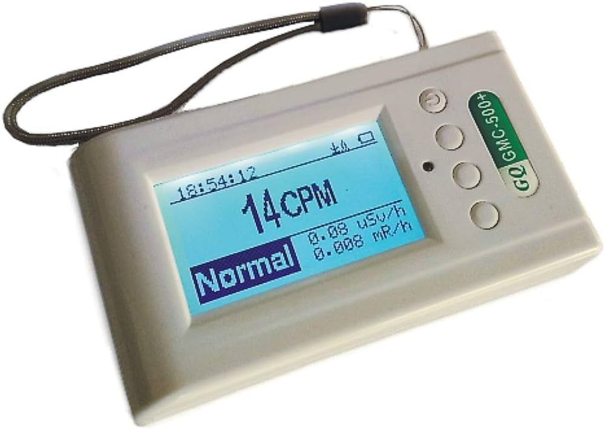
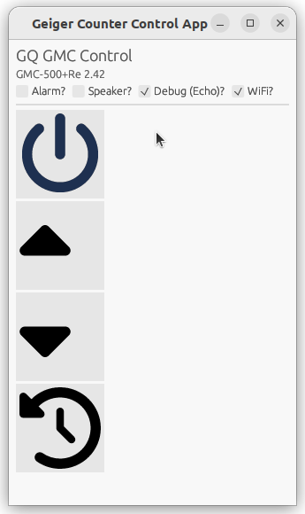
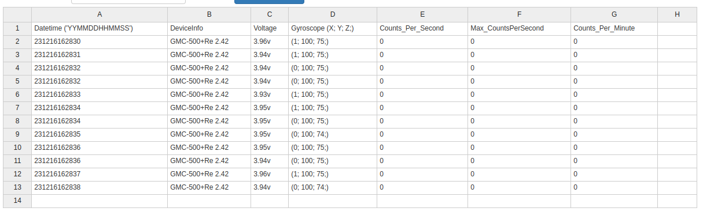

# Background

A company called GQ makes "smart" nuclear radiation detecting devices aka ["geiger counters"](https://en.wikipedia.org/wiki/Geiger_counter). These devices come with a USB port which provides a serial interface to the device, intended for data logging usage.



GQ published their "RFC" which provides the serial port interface specifications. See `RFC1801.txt`.


# About

This project consists of helper tools for using your GQ GMC.

There's 3 main functionalities provided:

1. A simple GUI application for controlling system parameters and device buttons:



This is particularly useful if your device is out of reach or if the physical buttons no longer work for whatever reason.

2. A "timesync" feature, allowing you to synchronize your geiger counter with your host PC's time. This is useful since these devices don't have any kind of NTP functionality.

3. A CSV logging feature. This logs the geiger counter's readings directly to a CSV file, and is useful when you need to take long-running measurements that would exceed the geiger counter's on-device storage.



5. A config dump feature. 🚧 This lets you see a parsed version of the device's configuration memory and take backups of it.


# Usage

Run the binary providing the first and second arguments as the serial device name and baud rate, and then thirdly, the option you wish to use, e.g.:

```bash
$ ./gq_gmc /dev/ttyUSB0 115200 --gui
```

to launch the GUI

```bash
$ ./gq_gmc /dev/ttyUSB0 115200 --timesync
```

to do the time synchronization

```bash
$ ./gq_gmc /dev/ttyUSB0 115200 --log <CSV_FILENAME>
```

to store records to CSV file.
